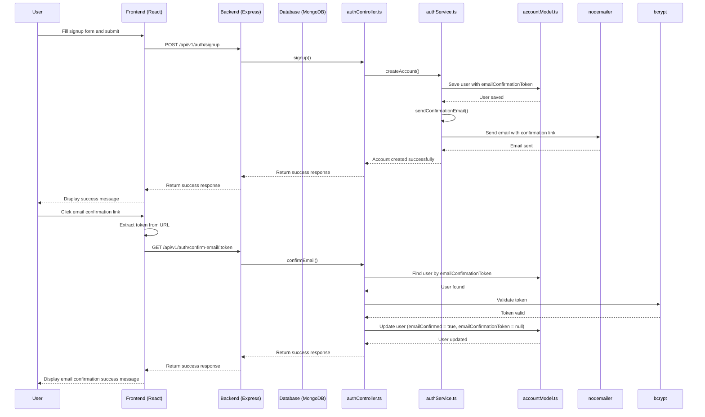

# FlatMatch Prototype Repository

by Raphael Travnicek, Maurice Lichtenberg, Jema Karachantsava and Julian Strietzel

Have a look into our documentation: [Business](docs/business_idea.pdf), [walk-through](docs/technical_description.pdf) and [screenshots](docs/demo_screenshots.pdf).

## Run dockerized application

To run the application in a docker container, you need to have docker installed on your machine.  
After cloning the repository, navigate to the root directory of the project and run the following command:

```bash
docker-compose up --build
```
The build flag is only necessary the first time you run the application or if you made changes to the Dockerfile.

The frontend is accessible at `http://localhost:5173` and the backend at `http://localhost:3000`.


## Technologies Used

### Frontend

- **React**: A JavaScript library for building user interfaces.
- **Vite**: A build tool that provides a faster and leaner development experience for modern web projects.
- **TypeScript**: A typed superset of JavaScript that compiles to plain JavaScript.
- **ESLint**: A tool for identifying and reporting on patterns in JavaScript.
- **Prettier**: An opinionated code formatter.
- **MUI (Material-UI)**: A popular React UI framework.

### Backend

- **Express**: A minimal and flexible Node.js web application framework.
- **TypeScript**: A typed superset of JavaScript that compiles to plain JavaScript.
- **Nodemon**: A utility that monitors for changes in your source and automatically restarts your server.
- **dotenv**: A module to load environment variables from a `.env` file into `process.env`.
- **Mongoose**: A MongoDB object modeling tool designed to work in an asynchronous environment.
- **MongoDB**: A general-purpose, document-based, distributed database built for modern application developers and for the cloud era. 

## Getting Started on development

### Prerequisites

Ensure you have the following installed on your development machine:

- **Node.js**: (version 14.x or higher)
- **npm**: (version 6.x or higher)

After cloning, install the packages by using `npm install` once in the backend, and once in the frontend.
Both the frontend and the backend server can afterwards be started with `npm run dev`

### Environment Variables
To correctly run the application, you need to create a `.env` file in the root of the backend and frontend directory.  
The schema is described in the `.env.example` file in both directories.  
The values in the files should be replaced by the actual values that we securely exchanged and should never be commited! 

### Database

The database is hosted on MongoDB Atlas.  
To access go to the [MongoDB Atlas](https://www.mongodb.com/cloud/atlas) website and login with the credentials we provided.

### Stripe

For payment integration we use Stripe. To run this locally you need to create a Stripe account and get the API keys.
Then you need to add the keys to the `.env` file in the backend directory.
Call `stripe listen --api-key "STRIPE_SECRET" --forward-to http://backend:3000/payments/stripe/webhook` to start the webhook listener.
As the app is not running publicly (yet), using the stripe-cli to add a local webhook to forward payment events was chosen instead of a different solution.
This also serves as a basis for deploying the app publicly.
When running the application directly via the Docker compose, this is not necessary additionally.


# Signup Process

